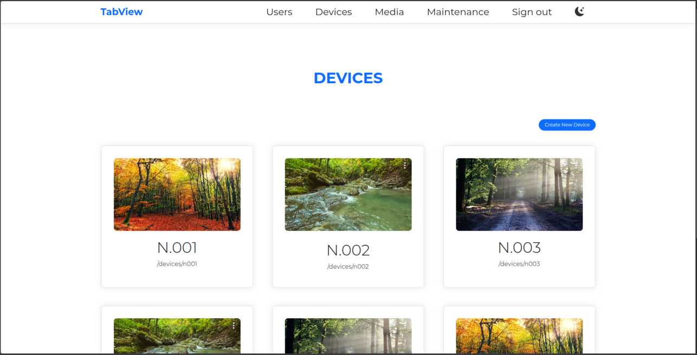

# TabView System


[](LICENSE)
[](https://github.com/MaxPolak04/tab_view/actions)
[](https://aquasecurity.github.io/trivy/)

## 📌 About the Project

**TabView** is a dedicated web platform created for **eNStudios** to centrally manage information tablets (Room Booking / Status Display). The system solves the problem of manually updating conference room statuses and display devices.

The project was delivered in an end-to-end model: from client problem analysis, through architecture and development, to setting up CI/CD pipelines and production deployment.

<br>
<div align="center">
  
</div>
<br>

### Key Features
* **Resource Management:** Full CRUD for Users, Media, and Devices.
* **Interactive Schedule:** Media display queue management via `FullCalendar.io` interface, integrated with the API (`Flask-RESTful`).
* **Media Queueing:** Precise sequencing of photos and videos displayed on tablets.
* **Role System:** Permission separation (Admin / User).
* **Interface:** Responsive UI based on Jinja2 templates and Bootstrap (Dark/Light mode).

---

## 🏗 Architecture & Tech Stack

> 📖 **Architecture Decision Records (ADR):** Detailed technical decisions, trade-offs, and architectural context are documented in the [`docs/adr/`](docs/adr/) directory.

The project relies on a modern Python stack with a focus on performance and stability.

### Backend & Data
* **Language:** Python 3.12
* **Framework:** Flask Ecosystem (Blueprints, Application Factory Pattern, Flask-RESTful).
* **Database:** MySQL (persistent data storage).
* **Cache & Queues:** Redis (session caching, rate limiter handling).
* **Package Management:** `uv` – a modern, ultra-fast Python package manager.
* **Background Tasks:** `APScheduler` (handling cyclic system tasks).

### Frontend
* **Rendering:** Server-Side Rendering (SSR) using `Jinja2`.
* **UI/UX:** Bootstrap + `FullCalendar.io` + custom JavaScript.

---

## 🚀 DevOps & Infrastructure

This project places special emphasis on **Infrastructure as Code (IaC)** and full containerization to ensure environment reproducibility. It strictly follows a "Shift-Left Security" philosophy.

### Containerization & Deployment
The entire application is containerized using **Docker** and runs as a rootless `appuser` for enhanced security. The architecture consists of the following services:
1.  **NginX (Reverse Proxy):** Runs on port `80`, handles incoming traffic, and terminates proxy headers.
2.  **Web (Gunicorn):** WSGI application server isolated on internal network.
3.  **Database (MySQL) & Redis:** Completely isolated on the internal `flasknet` network (ports 3306 & 6379 are not exposed to the host system for security reasons).

### CI/CD Pipeline (GitHub Actions)
An advanced pipeline automates the software delivery process enforcing a strict **GitHub Flow**:
* **Quality Gates:** Ruff (Linting & Formatting), Pytest run on every Pull Request.
* **Build & Registry:** Automatically building and pushing images to **GHCR** only upon successful merge to `main`.

---

## 🛡️ Security

The approach to security in TabView is twofold: security built into the application (**App Security**) and automatic audits in the development process (**DevSecOps**).

### 1. Application Security (Runtime)
Features protecting the running application in production:
* **SQL Injection Protection:** Utilizing `SQLAlchemy ORM` for query parameterization.
* **CSRF Protection:** All forms protected by tokens generated by `Flask-WTF`.
* **Rate Limiting:** Protecting the API against Brute-Force and DDoS attacks using `Flask-Limiter` (with `Werkzeug ProxyFix` to accurately track client IPs behind Nginx).
* **Secure Passwords:** Hashing with rainbow-table resistant algorithms.

### 2. DevSecOps & Code Quality (Pipeline)
A set of tools triggered automatically in GitHub Actions and as `pre-commit hooks`:
* **Container Security:** `trivy` automatically scans built container images for OS and library vulnerabilities on every PR.
* **Dockerfile Linting:** `hadolint` enforces best practices in container layer optimization and security.
* **Vulnerability Scanning (SCA):** `pip-audit` checks dependencies for known security vulnerabilities (CVE).
* **Static Application Security Testing (SAST):** `bandit` analyzes source code for insecure patterns.

---

## ⚙️ Installation & Setup

Requirements: Docker and Docker Compose.

1.  **Clone the repository:**
```bash
git clone https://github.com/MaxPolak04/tab_view.git
cd tab_view
```

2.  **Configure environment variables:**
    Create a `.env` file based on `.env.example`:
```ini
FLASK_APP=tab_view
SECRET_KEY=your-very-secret-key
DATABASE_URL=mysql+pymysql://user:pass@db/dbname
MYSQL_ROOT_PASSWORD=secure-root-pass
MYSQL_PASSWORD=secure-db-pass
```

3.  **Start the environment (Development):**
```bash
docker compose up -d
```

4. **Start the environment (Production with Syslog):**
```bash
docker compose -f docker-compose.yml -f docker-compose.prod.yml up -d
```

5. **The application will be available at: http://localhost:80**

### CLI - User Management
To create a user inside a running container:

```bash
# Syntax: flask create-user [user] [pass] --admin (optional)
docker compose exec web flask create-user john P@ssw0rd123 --admin
```

---

## 👨‍💻 About the Author & Learning Journey

I am an aspiring Junior Developer, and **TabView** is a project I realized during my student internship at eNStudios.

**Context:**
The application was created in a **Client (IT Admin) – Contractor (Me)** relationship. The company needed a dedicated solution but lacked the budget for commercial software or a Senior Developer to guide me. I had to fill this gap independently.

**My Path and Challenges:**
As a one-person team, I had to step out of the programmer role and take full responsibility for the product:
* **Engineering over Coding:** I didn't focus just on making the code "work", but on making it secure, maintainable, and resilient (e.g., handling backups, predicting production edge-cases).
* **Self-Education:** I learned everything – from architecture to CI/CD – on the fly, researching user needs and verifying best practices in documentation and online resources.
* **Conscious AI Use:** Artificial Intelligence was my mentor and reviewer (suggesting DevSecOps implementation, among other things), but never the "manager". **I am not a "VibeCoder"** – I verified every AI suggestion, and ultimately, I know and understand every line of code in this repository.

This project proved to me that I can deliver a complete, secure, and deployable solution, even under the pressure of limited resources and lack of mentorship.

---

## 📫 Feedback & Contact

As a student and beginning software engineer, I have made every effort to ensure this project meets production standards and adheres to Best Practices. However, your feedback is incredibly valuable to me.

Feel free to reach out via:
* **GitHub Issues:** For technical bug reports.
* **LinkedIn:** [Professional contact & networking](https://www.linkedin.com/in/maksymilian-polak)

---

## 📄 License

This project is licensed under the **Creative Commons Attribution-NonCommercial 4.0 International (CC BY-NC 4.0)**.
See the [LICENSE](LICENSE) file for details.
